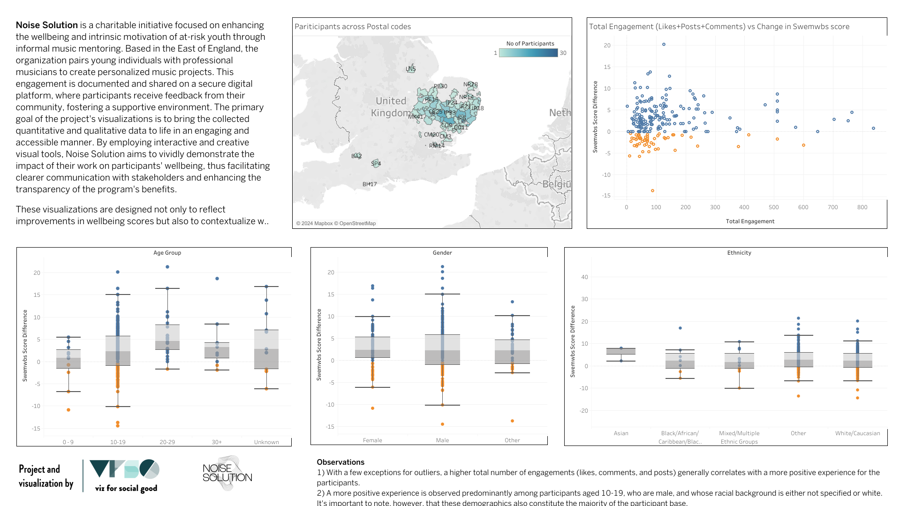

Noise Solution is a charitable initiative focused on enhancing the wellbeing and intrinsic motivation of at-risk youth through informal music mentoring. Based in the East of England, the organization pairs young individuals with professional musicians to create personalized music projects. This engagement is documented and shared on a secure digital platform, where participants receive feedback from their community, fostering a supportive environment. The primary goal of the project's visualizations is to bring the collected quantitative and qualitative data to life in an engaging and accessible manner. By employing interactive and creative visual tools, Noise Solution aims to vividly demonstrate the impact of their work on participants' wellbeing, thus facilitating clearer communication with stakeholders and enhancing the transparency of the program's benefits. 

These visualizations are designed not only to reflect improvements in wellbeing scores but also to contextualize what these changes mean in the participants' real-life experiences, thereby driving home the effectiveness of the program.

The full dashboard can be found at [Noise Solution Dashboard](https://public.tableau.com/shared/SDYGQWM8Z?:display_count=n&:origin=viz_share_link) and a screenshot of the dashboard is below
 